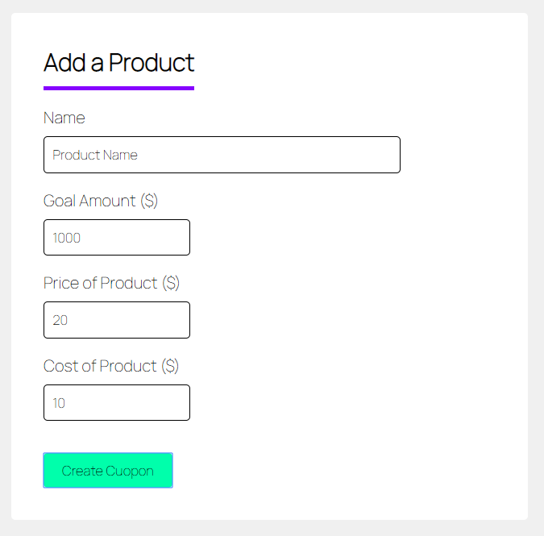
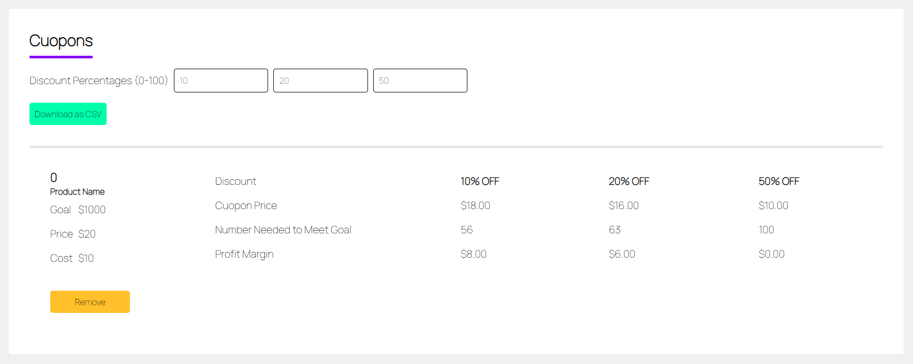
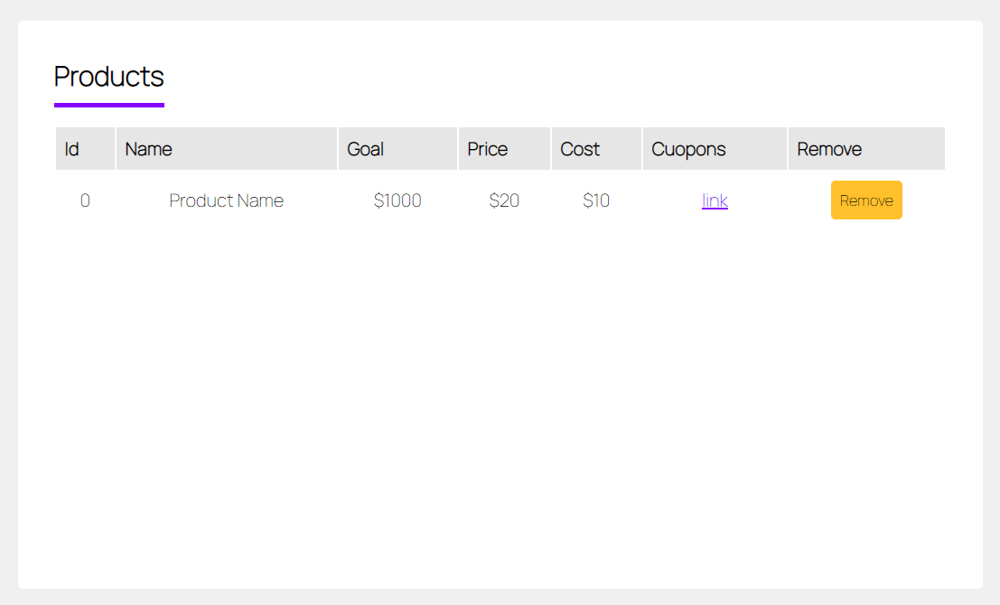

# Cuopon Calculator || React.js Single Page App 

Contents:

- Overview
- Live Example
- Installation
- Documentation

## Overview

This is a single page app that creates cuopon data to be downloaded in a csv. It's built using [React.js](https://reactjs.org/) and [react-csv](https://www.npmjs.com/package/react-csv). 

An input form takes in the following data of a product you are trying to sell a cuopon for:
  - Name
  - Goal Amount
  - Price of Product
  - Cost of Product



It then calculates cuopons based on 3 different percentages and lists how many of them you would need to sell to meet your goal amount.



You can add as many products as you would want. You can adjust the three discount percentages to see which would work best.



After adding all your products and adjusting the discount percentages, you can export the data in a csv.


## Live Example

http://cuoponcalculator.hackersupreme.com/


## Installation

This assumes you have the following installed:
  - node.js 
  - node package manager (npm)

Get both here: https://nodejs.org/

###### Instructions

1. Create file directory on your local device
2. Download files to that directory

_note: PNG images are for this document, not needed for the project_

3. Using a command line software, enter the directory
```
cd directory-name
```
4. Use npm install to get the node modules
```
npm install
```
5. Use npm start to start the server
```
npm start
```


## Documentation

The magic happens in the src folder.


###### Folder Structure

```
public
src
  L App.js
  L index.css
  L index.js
  L Components
    L CuoponComponent.js
    L DiscountForm.js
    L InputForm.js
.gitignore
package-lock.json
package.json
```

**App component || App.js**

Controls the state of the app as well as contains the definitions for functions that affect the state. It passes those down to the view components located in the Components folder.

###### State

```
this.state = {
  products: [],
  name: "",
  goal: 0,
  price: 0,
  cost: 0,
  discounts: [0.1, 0.2, 0.5]
}
```

###### Functions
- `addProduct(e)`
- `removeProduct(index)`
- `updateDiscounts(e)`
- `generateProducts()`
- `generateCuopons()`
- `generateCSV()`

###### Display

```
render() {

  ...
  
  return(
    <React.Fragment>
    <header>...</header>
    <main>
      <InputForm />
      <ProductList />
      <CuoponList>
        <DiscountForm />
        CSV Button
      </CuoponList>
    </main>
    <footer>...</footer>
    </React.Fragment>
  )
}
```

**Input Form || InputForm.js**

Contains the form html for updating the variables `name`, `goal`, `price`, and `cost` in the state. 

The state is updated through an arrow function that is passed down as a prop. 

i.e.
```
<InputForm

setName={(e) => this.setState({name: e.target.value})}
...

/>
```

On submit, the `addProduct(e)` function fires. The `addProduct(e)` function takes the state variables `name`, `goal`, `price`, and `cost` and makes an object out of them. That object is added to the `products` array in the state.

**Product List || ProductList.js**

Recieves the `products` array from the app's state and creates a table out of them. Includes links to the id of the cuopon associated with it as well as a button to remove the product from the `products` array.

**Cuopon List**

This section contains a list of cuopons that correspond to the products added through the input form and displayed in the product list.

It also contains a form to update the discount percentages in the state and a button that downloads the csv file.


